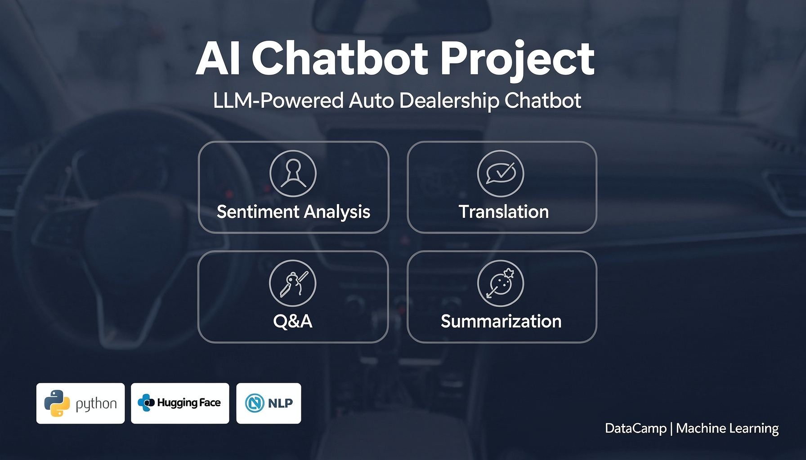

# Machine Learning-DataCamp-projects
Kiron/DataCamp Project
# 🚗 LLM-Powered Chatbot for Auto Dealership — Car-Ing

A guided machine learning project completed as part of the **DataCamp Machine Learning Course**.

---

## 📌 Project Overview

This project involved building a prototype AI chatbot for **Car-Ing**, a fictional auto dealership company specializing in car sales and rental. As the newly recruited AI and NLP developer, the goal was to design a multi-functional chatbot powered by pre-trained **Large Language Models (LLMs)** from Hugging Face, capable of assisting both customers and internal company agents.

The chatbot was built using **Python** and developed in a **Jupyter Notebook** environment via the DataCamp Workspace. It processes textual prompts and applies four core NLP tasks to car reviews: **sentiment classification**, which determines whether a review is positive or negative; **translation**, which converts reviews into another language; **question answering**, which extracts relevant information from a review in response to a user query; and **summarization and analysis**, which condenses long reviews into concise key points.

A key highlight of this project is the integration of four distinct NLP capabilities into a single chatbot prototype, demonstrating how one LLM-powered application can serve multiple real-world business needs. This was completed as a beginner-level guided project through DataCamp's Machine Learning course, making it a strong foundation for further work in AI and data science.

---

## 🎯 Project Goals

Build a prototype chatbot that can handle the following tasks on car reviews and customer queries:

| # | Task |
|---|------|
| 1 | **Classify** the sentiment of a car review |
| 2 | **Translate** a car review into another language |
| 3 | **Answer questions** about a car review |
| 4 | **Summarize and analyze** a car review |

---

##  Key Achievements

- ✅ Classified the **sentiment** of car reviews (positive/negative)
- ✅ **Translated** car reviews into another language using an LLM
- ✅ Built a **question-answering** system on car review text
- ✅ Automated **summarization and analysis** of car reviews
- ✅ Integrated **4 different NLP tasks** into a single chatbot prototype
- ✅ Applied real-world AI to a business use case as a beginner

---

##  Technologies Used

- **Python** — core programming language
- **Hugging Face Transformers** — pre-trained LLMs for NLP tasks
- **Natural Language Processing (NLP)**
- **Jupyter Notebook** — development environment
- **DataCamp Workspace** — project platform

---

##  What I Learned

- How to load and use pre-trained LLMs from Hugging Face for multiple NLP tasks
- How to apply a single language model to different real-world use cases (classification, translation, Q&A, summarization)
- How LLMs can power practical business applications like customer-facing chatbots

---

##  Source

Completed via [DataCamp](https://www.datacamp.com) — Guided Project  
**Course:** Machine Learning in Python

---

*This project is part of my growing data science & ML portfolio.*

